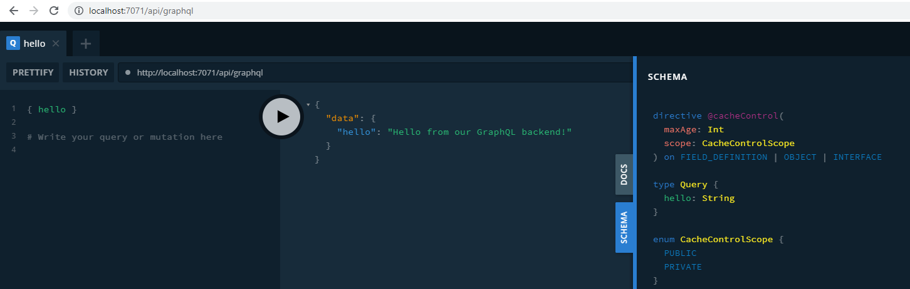

# GraphQL TypeScript Hello World

A simple hello world example using GraphQL TypeScript using Apollo server.

## Getting Started

### Installation and start function

- `npm install && npm start`

This quickstart works with `apollo-server-azure-functions` v2 only.

### Quickstart using GraphQL Playground

1. Open browser to `http://localhost:7071/api/graphql`
2. Enter query `{hello}`

    

3. View response `{"data":{"hello":"Hello from GraphQL backend"}}`

    For a more comprehensive example, open the browser's development tools (F12) and re-enter the query in the playground. 

### Quickstart using cURL

1. Open bash terminal.
2. Enter cURL command:

    ```bash
    curl 'http://localhost:7071/api/graphql' \
        -H 'content-type: application/json' \
        --data-raw '{"query":"{hello}"}' 
    ```
3. View response `{"data":{"hello":"Hello from GraphQL backend"}}`

### Deploy to Azure

1. In VS Code, create the Azure Function resource.
2. Deploy the root folder to your resource. Do not select the `/dist` folder. It will be created as part of the build process.